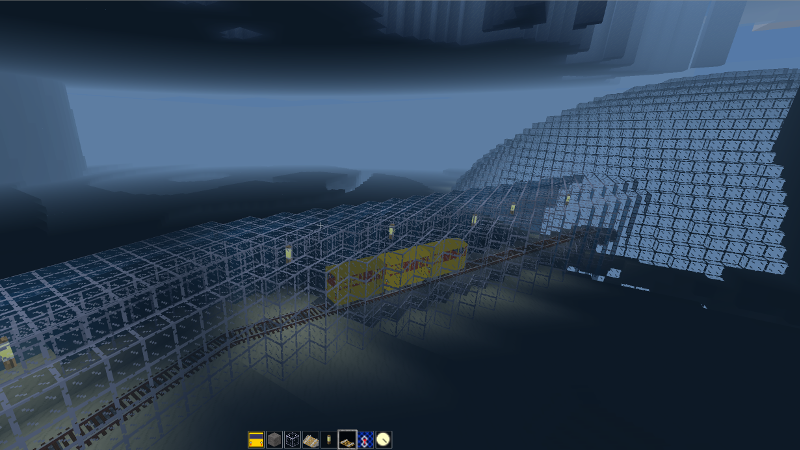
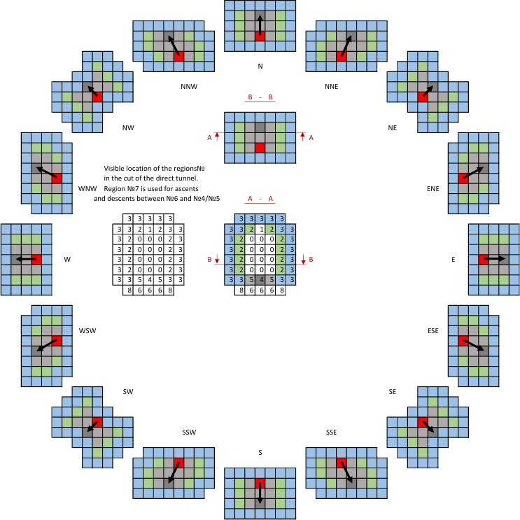
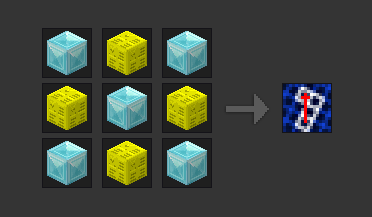

A Minetest Mod to easily create arbitrarily curved tunnels.

Especially designed to make laying track for the advtrains mod easier.

by David G (kestral246@gmail.com)


Features
--------
- Creates tunnel segments in any of the sixteen possible advtrains track directions with one click.
- Direction of digging based on direction player is pointing.
- Provides changing icon to help player align in proper direction, based on compassgps mod.
- Checks ceiling for blocks capable of falling, and replaces them with cobblestone.
- Adds cobblestone reference blocks in floor to show next dig point, and to help with placing advtrains track.
- Adds torches to ceiling if ceiling is stone or desert_stone, to help with seeing.

- Only allows tunnel digging when in creative mode.
- Uses privileges, requires "tunneling" privilege to be able to use.
- Checks protection, and doesn't dig any protected nodes.

- Reference point is at ground level: possible to increase or decrease the grade by changing the height of the reference node.
- Fills in holes in flooring with stone.
- Works outside of tunnels to clear ground and provide cuts and fills.


New features
------------
- I added a biome check when using minetest version 0.5.x, which will change the fill to desert stones for desert biomes.  For version 0.4.x, tunnelmaker will still work, but will continue to just use regular stone fill.
- I updated this mod to check for water while tunneling.  Tunnelmaker will now add a glass wall around the tunnel to prevent water from entering the tunnel.  A temporary glass endcap is also added to the end of the tunnel.  What this means is that it is now possible to effectively dig tunnels through water.  Now you can easily run trains to your underwater sea bases.




How to use
----------
Minetest needs to be in creative mode for this mod to work—it is too overpowered otherwise.

Player needs to have tunneling privilege to be able to use the tunnelmaker tool (/grant &lt;player&gt; tunneling).

To give player a tunnelmaker tool use (/give &lt;player&gt; tunnelmaker:1). *See below for crafting recipe.*

The following diagrams show how to make curved tunnels that support the different track configurations used by advtrains. There are three basic directions that are supported: 0° (orthogonal, rook moves), 45° (diagonal, bishop moves), and 26.6° (knight moves, two blocks forward and one block to the side).

To use this mod, move your character to the existing end of the tunnel, highlight the gray node marked with an x, and point character in direction of red arrow. The icon in the inventory, if visible, will change it's image to confirm direction. Then right-click mouse to dig the green highlighted area. (Note that turns with angles other than those show are possible, but aren't supported by advtrains track.)

Using left-click digs similarly to a wooden pickaxe, which is useful for making minor adjustments.

To increase the grade, place a block on the gray node and select that before right-clicking. To decrease the grade, dig out the gray node and select the lower node before right-clicking. (Note that advtrains only supports slopes for 0° and 45° track.)


Update
------
Switched digging function from dig_node to node_dig.  This was based on what matyilona200 used for the tunneltest mod.  Thanks matyilona!  This gives several improvements:

- When tunneling, the inventory adds only a single instance of each type of block dug.  Still works if inventory is full.
- Works the same with minetest versions 0.4.16 and 0.5.0-dev—no more blocks raining down.
- Works with digall mod enabled.  However, make sure digall is deactivated before tunneling!


Digging pattern reference
-------------------------
Here are all sixteen possible digging patterns for reference, updated to show the changes needed to deal with water.  With no water nearby, the resulting tunnel is almost the same as before—a couple of slight irregularities have been fixed.




Crafting guide
--------------
```
  diamondblock   mese_block     diamondblock
  mese_block     diamondblock   mese_block
  diamondblock   mese_block     diamondblock
```




License
-------
- **textures:** License CC0-1.0 
- **code:**  My changes to original code are CC0-1.0
- **original compassgps license:** Original code by Echo, PilzAdam, and TeTpaAka is WTFPL. Kilarin (Donald Hines) changes are CC0 (No rights reserved)


Thanks
------
- [advtrains](https://github.com/orwell96/advtrains/) / orwell96, et.
al. - For providing the amazing advtrains mod that this mod tries to make
just a little easier to use.
- [compassgps](https://github.com/Kilarin/compassgps) / Kilarin (Donald Hines),
et. al. - Top level code to change icon based on direction player is pointing.
