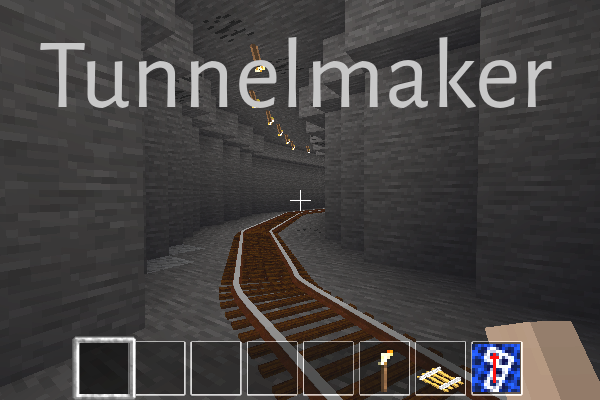
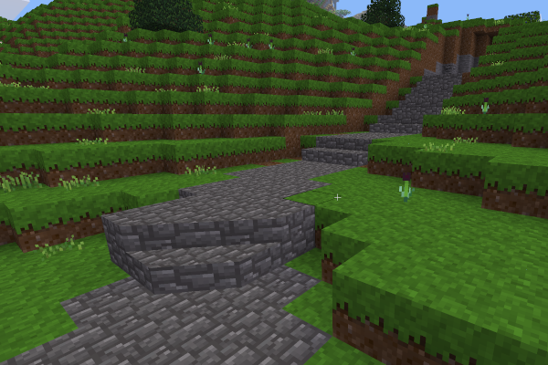
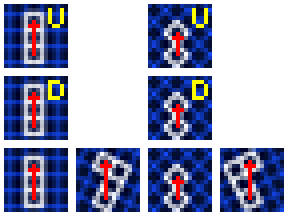
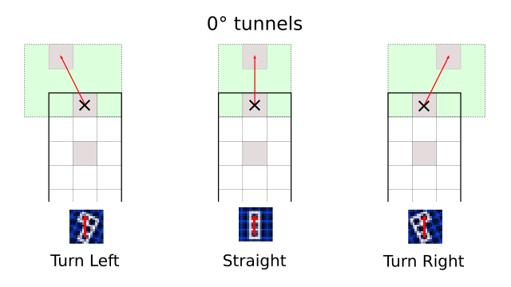
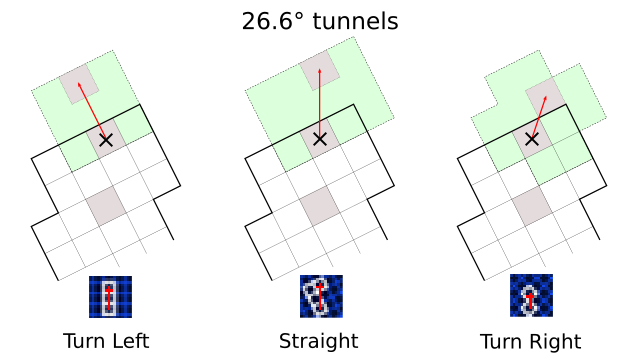
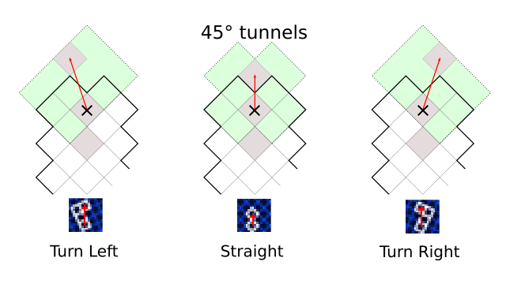

Tunnelmaker 2.0
===============

A Minetest Mod to easily create arbitrarily curved tunnels, pathways, and bridges.

By David G (kestral246@gmail.com), with significant contributions by Mikola.

Warning: Version 2.0 only supports Minetest 5.0+.
-----------------------------------------------
For Minetest 0.4.x, use the git branch legacy, or the following zip file: [tunnelmaker-legacy.zip](https://github.com/kestral246/tunnelmaker/archive/legacy.zip).

Quick Use Guide
---------------
- Requires "tunneling" privileges to use: *(/grant &lt;player&gt; tunneling)*.
- No crafting recipe: *(/give &lt;player&gt; tunnelmaker:tool1)*.
- Left-click mouse to dig just about any node with one click.
- To dig train tunnel:
    - Point cursor at ground level.
    - Point character in direction to dig (inventory icon will change to show direction).
    - Right-click mouse to dig tunnel.
    - Note that reference nodes are placed in the ground. Just follow these to make nicely curved tunnels. Don't worry, they can be easily removes when done digging.
- Shift-left-click brings up User Options menu.

Features *(Does way more than just dig tunnels!)*
--------
- Create paths, bridges, and tunnels in all sixteen possible advtrains track directions with one click.
- Also digs up or down in the eight possible advtrains slope track directions.
- New User Options menu to set digging mode and other options.
- Mode 1: General purpose excavation with unlined and lined tunnels.
- Mode 2: Advanced trains mod with gravel embankment, arched and optionally lined tunnels, and two widths of bridges.
- Mode 3: Bike mod with two widths of cobblestone pathways and bridges, along with unlined tunnels.
- Supports 
- Adds reference nodes to help digging and laying advtrains track—now easy to remove when done.
- Adds glass enclosure when in water to create water tunnels.
- Requires "tunneling" privilege, and checks protections before digging.
- No crafting recipe, so needs to be given to player.
- Works in both creative and survival modes, but tunneling does not place any nodes into user's inventory.
- Supports client-side translation files. Currently supports German **(recently provided by xenonca),** Russian (by Mikola), and my attempt at French. **Other languages will be gratefully accepted.** (Reference template file is available in locale directory.)

Controls
--------
- **Left-click:** Super dig one node. One click digs nearly any node (non-repeating) and places it in player's inventory.
- **Shift-left-click:** Bring up User Options menu. (Can also use Aux-right-click for Android.)
- **Right-click:** - Dig tunnel in direction player pointed. Note that this won't place any of the dug nodes in player's inventory.
- **Shift-right-click:** Cycle through vertical digging modes, up, down, and horizontal.

How to enable
-------------
- Install tunnelmaker mod, requires default and stairs. For nicer bike path ramps, I recommend installing the angledstairs mod, which was used for the picture above, but it's not required.
- Grant player "tunneling" privilege *(/grant &lt;player&gt; tunneling)*.
- To give player a tunnelmaker tool use *(/give &lt;player&gt; tunnelmaker:tool1)*.

How to dig
----------
*See diagram below that shows track configurations supported by advtrains.*

- Move to digging location and highlight node at ground level. (Gray node in diagrams marked with an '×'.)
- Point player in desired digging direction. (Inventory icon will change to show current direction.)
- Right-click mouse to dig tunnel.

Digging for slopes
------------------
*Note that advtrains only supports sloped track for orthogonal and diagonal track directions.*

- Move to digging location and highlight node at ground level.
- Point player in desired digging direction.
- Shift-right-click mouse to select vertical digging mode.  Inventory icon will cycle through possible modes with each click:  'U' for digging up, 'D' for digging down, and no letter for default horizontal.
- Right-click mouse to dig tunnel.
- There is a user option to control whether to reset direction after each dig or not (see below).

User Options menu
----------------
Shift-left-click to bring up this menu.

Descriptions of all the options:

- **Digging mode** Select one of the three digging modes: General purpose, Advanced trains, or Bike paths.
- **Wide paths / lined tunnels** Select between narrow and wide paths, and whether tunnels are lined with stone or not.
- **Continuous up/down digging** Don't reset up/down after each dig.
- **Clear tree cover** Remove all plant material above dig up to 30 nodes above ground. CPU intensive, so shuts off after two minutes.
- **Remove reference nodes** Easily remove reference nodes by walking over them. Also shuts off after two minutes.
- **Lock desert mode to: either "Desert" or "Non-desert"** Option only available when "add_desert_material = true" has been added to minetest.conf. Overrides use of desert materials in desert biomes. Useful for transition regions.

minetest.conf options
---------------------
- Several options to change defaults for the User Options menu. See settingtypes.txt for details.
- **add_desert_material** (default = false): When enabled, this mod will use desert materials when digging in desert biomes. This will also add an additional entry to the User Options menu.
- **tunnel_lights** (default = desert:torch): Use this to change type of light placed in tunnels. Some examples are: default:mese_post_light; morelights_vintage:lantern_c; ilights:light; and mydefaultlights:ceiling_light_white,20. This last one requires the ",20" on the end, which defines the param2 rotation needed to put the lamp on the ceiling.
- **train_tunnel_height** (default = 5): Can increase train tunnels up to a height of 8.
- **train_tunnel_arches** (default = true): Disable to get rid of arches to give more modern rectangular tunnels.

Advtrains digging reference
---------------------------
The following diagrams show how to make curved tunnels that support the different track configurations used by advtrains. There are three basic directions that are supported: 0° (orthogonal, rook moves), 45° (diagonal, bishop moves), and 26.6° (knight moves, two blocks forward and one block to the side).

- *Note that it's always possible to dig in any direction, but turns with angles other than those shown won't be supported by advtrains track.*
- *Also note that there are other limitations to advtrains slope track.  Documentation TBD.*

License
-------
- **textures:** License CC0-1.0 
- **code:**  My changes to original code are CC0-1.0
- **original compassgps license:** Original code by Echo, PilzAdam, and TeTpaAka is WTFPL. Kilarin (Donald Hines) changes are CC0 (No rights reserved)

Thanks
------
- [advtrains](https://github.com/orwell96/advtrains/) / orwell96, et.
al. - For providing the amazing advtrains mod that this mod tries to make
just a little easier to use.
- [compassgps](https://github.com/Kilarin/compassgps) / Kilarin (Donald Hines),
et. al. - Top level code to change icon based on direction player is pointing.
