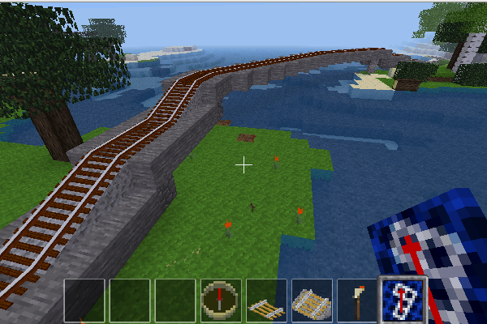

A Minetest Mod to easily create arbitrarily curved tunnels.

Especially designed to make laying track for the advtrains mod easier.

by David G (kestral246@gmail.com)


Features
--------
- Digs "arched" tunnels (5 nodes wide and 5 nodes tall) in all sixteen possible advtrains track directions with one click. Also digs up or down in the eight possible advtrains slope track directions.
- Fills in tunnel floor (central 3 nodes wide) with stone. Outside of tunnels this can be used to  clear ground, provide cuts and fills, and build simple stone bridges. However, bridge supports will need to be added manually.
- **New:** Tunneling through water has been enabled by default. This will add a glass enclosure around the tunnel as you go. Configuration variable to disable, if desired.
- **New:** Height of tunnel and whether to use "arches" are now configuration options. (Defaults to height of 5 with "arches", which matches previous release.)
- Requires "tunneling" privilege, checks protections, and only works in creative mode.




How to enable
-------------
- Enable creative mode.  This mod is too overpowered for survival mode.
- Give player "tunneling" privilege (/grant &lt;player&gt; tunneling).
- To give player a tunnelmaker tool use (/give &lt;player&gt; tunnelmaker:1). *Or see below for crafting recipe.*


How to dig
----------
*See diagram below that shows track configurations supported by advtrains.*

- Move to digging location and highlight node at ground level. (Gray node in diagrams marked with an '×'.)
- Point player in desired digging direction. (Inventory icon will change to show current direction.)
- Right-click mouse to dig tunnel.


Digging for slopes
------------------
*Note that advtrains only supports sloped track for orthogonal and diagonal track directions.*

- Move to digging location and highlight node at ground level.
- Point player in desired digging direction.
- Hold sneak key (shift on pc) and right-click mouse to select digging mode.  Inventory icon will cycle through possible modes with each click:  'U' for digging up, 'D' for digging down, and no letter for default horizontal.
- Release sneak key and right-click mouse to dig tunnel.
- *Mode will reset after each dig.  It will also reset if player turns or moves.*


Advtrains digging reference
---------------------------
The following diagrams show how to make curved tunnels that support the different track configurations used by advtrains. There are three basic directions that are supported: 0° (orthogonal, rook moves), 45° (diagonal, bishop moves), and 26.6° (knight moves, two blocks forward and one block to the side).

- *Note that it's always possible to dig in any direction, but turns with angles other than those shown won't be supported by advtrains track.*
- *Also note that there are other limitations to advtrains slope track.  Documentation TBD.*


Other details
-------------
- Using left-click digs similarly to a steel pickaxe, which is useful for making minor adjustments.
- Cobblestone references are placed to show where to continue digging for laying advtrains track. (Configuration variable to disable.)
- If the ceiling is going to be a falling node, it is replaced with cobblestone before digging out below it.
- Torches are placed only if ceiling is stone or desert_stone. (Torch configuration options added.)
- Continuous up/down digging configuration option added.
- For minetest version 5.0+, when in desert biomes the fills will change to the desert versions of stone or cobble.
- Won't dig advtrains track.  Highlighting track will dig based on ground below it. However, be careful with slope track, since this probably isn't what you want. Also this won't work with ATC track, since it also uses right-click.


Crafting guide
--------------
```
  diamondblock   mese_block     diamondblock
  mese_block     diamondblock   mese_block
  diamondblock   mese_block     diamondblock
```


License
-------
- **textures:** License CC0-1.0 
- **code:**  My changes to original code are CC0-1.0
- **original compassgps license:** Original code by Echo, PilzAdam, and TeTpaAka is WTFPL. Kilarin (Donald Hines) changes are CC0 (No rights reserved)


Thanks
------
- [advtrains](https://github.com/orwell96/advtrains/) / orwell96, et.
al. - For providing the amazing advtrains mod that this mod tries to make
just a little easier to use.
- [compassgps](https://github.com/Kilarin/compassgps) / Kilarin (Donald Hines),
et. al. - Top level code to change icon based on direction player is pointing.
